# Guide to Installing Anaconda and Integrating it with the Bash Terminal on Windows
The Anaconda package will provide many of the key programs used in this class, including Python, Conda, and Jupyter Labs. Many of you likely already have this package installed, however, this will provide an installation guide. Additionally, this guide will explain how to get the Git Bash terminal to recognize Conda. If you already have Anaconda installed, but can not access conda commands in the bash terminal, skip to the "Bash Integration Instructions" portion of the guide.

## Anaconda Instalation Instructions

1. Navigate to [https://www.anaconda.com/download](https://www.anaconda.com/download), and click "Skip Registration"

2. Scroll down and select the "64-Bit Graphical Installer" for Windows
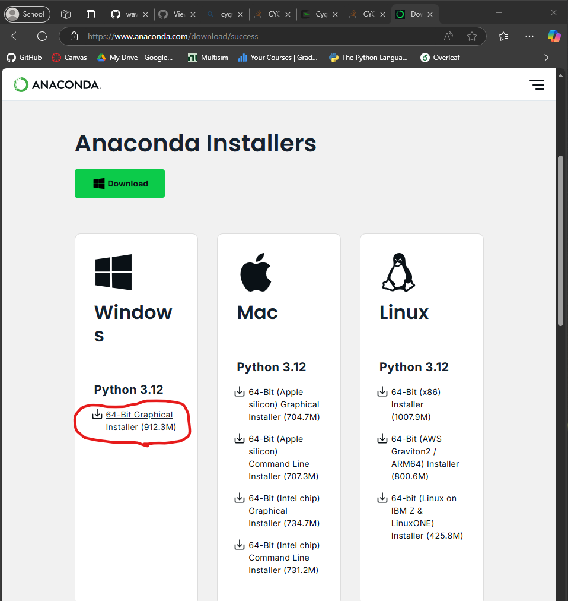

3. Open the Installation Manager and click "Next"
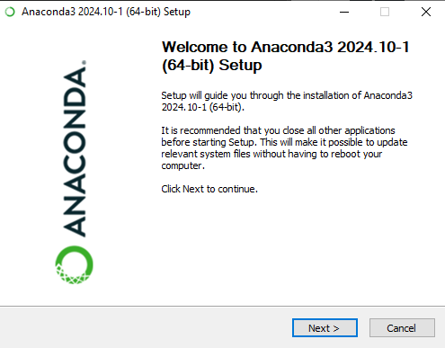

4. Accept the Anaconda License Agreement by clicking "I Agree"
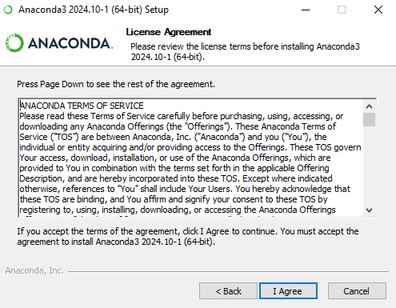

5. Select "Just Me" and click next
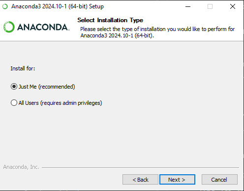

6. Select your user's home directory (should be the default destination folder) and click next
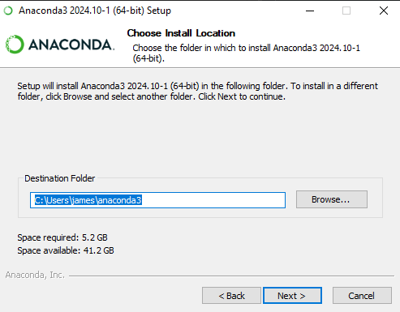

7. Select Advanced Installation Options to create shortcuts (if desired) and register Anaconda3 as the default Python program. Then, click install
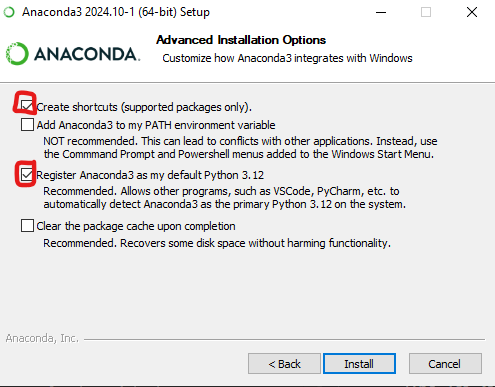

You should now have the Anaconda package installed to your computer. After the installation is complete, open the "Anaconda Navigator". You should see something similar to the image below. Note that Anaconda may request permission to update, even if you just installed it. Allow it to update if this happens.

## Bash Integration Instructions
The bash terminal will not automatically detect the Anaconda software and thus the conda program on Windows. In order to integrate the two, you must manually add Anaconda to your Windows path variable. This portion of the guide will instruct you how to do this
- __NOTE:__ The same effect can also be achieved by changing the .bashrc file, which directly configures the bash terminal. For the sake of simplicity, this guide uses the Windows path variable, but if you have worked with bash in the past and are confident in the shell, adding conda to the .bashrc path variable will also work.

1. Open the Windows Settings. Search "path", and select "Edit the system environment variables"
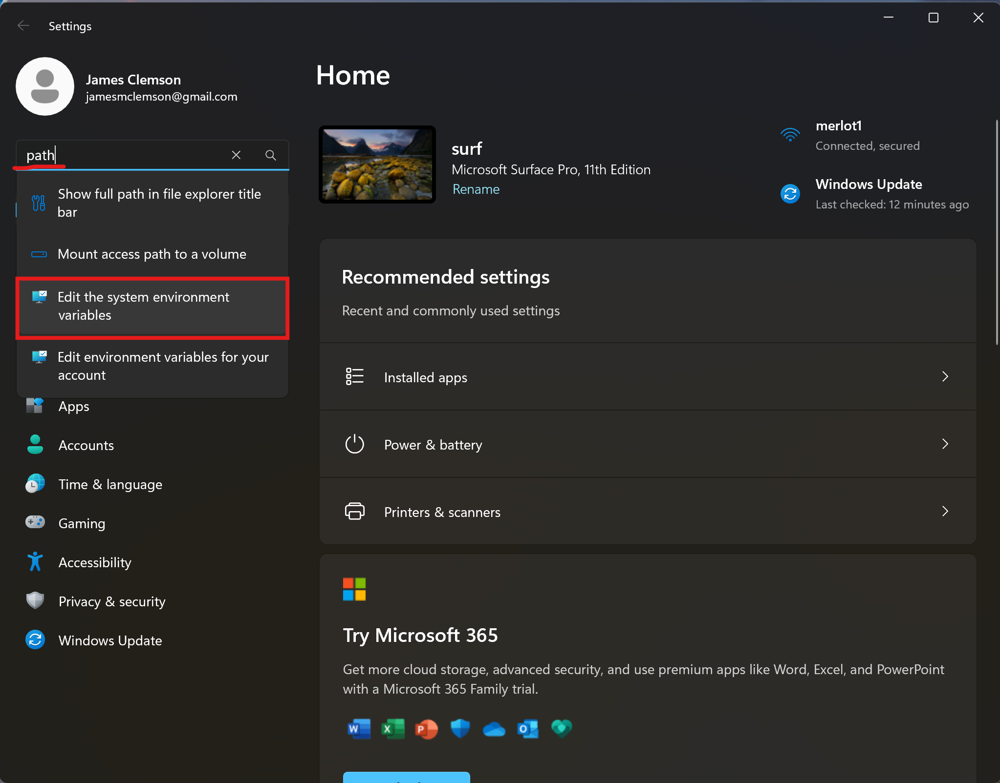

2. Click "Environment Variables"
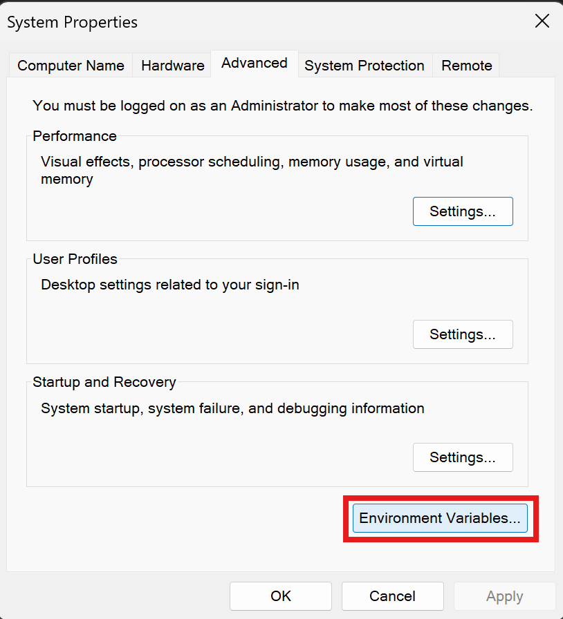

3. In the upper panel titled "User variables for ____", click to select the "Path" variable, then click "Edit"
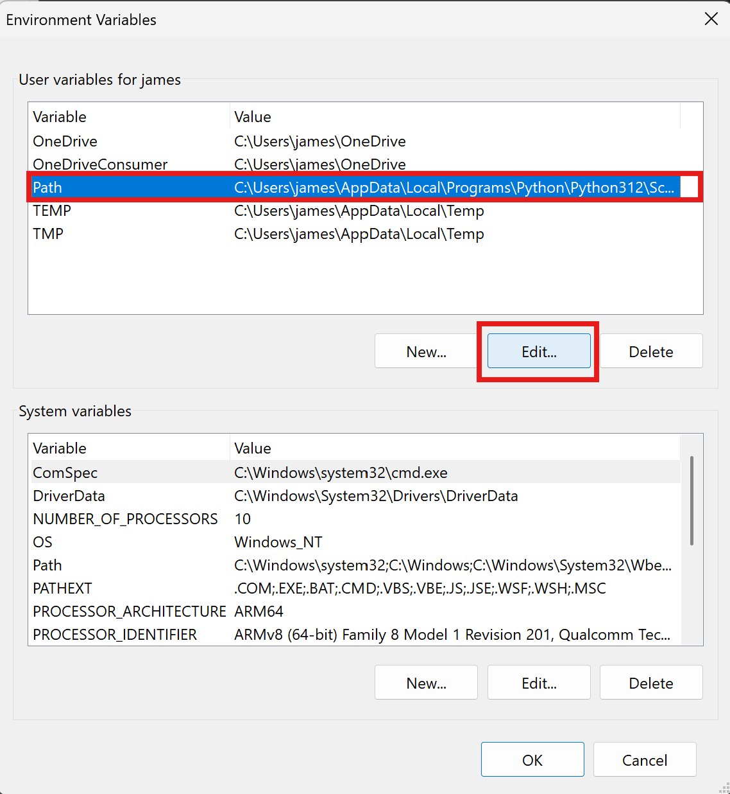

4. Click "New" and then "Browse". Note that your environment variable may look slightly different to the one in the example image
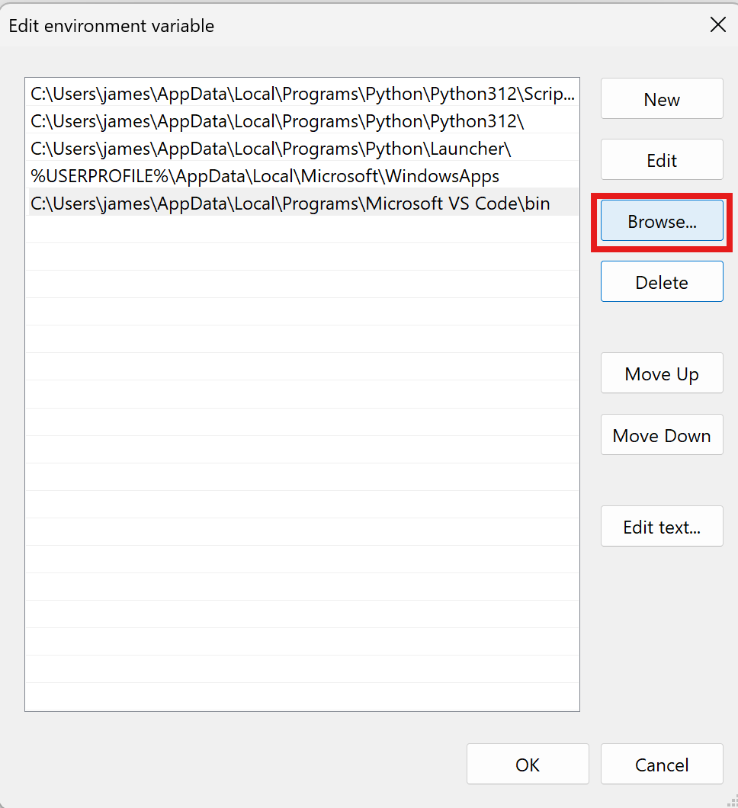

5. In the popup, navigate to and select the "anaconda3" folder. If Anaconda was installed without changing the default destination folder, this should be in your user's home directory (`C:/Users/_username_/anaconda3`). Then click "OK"
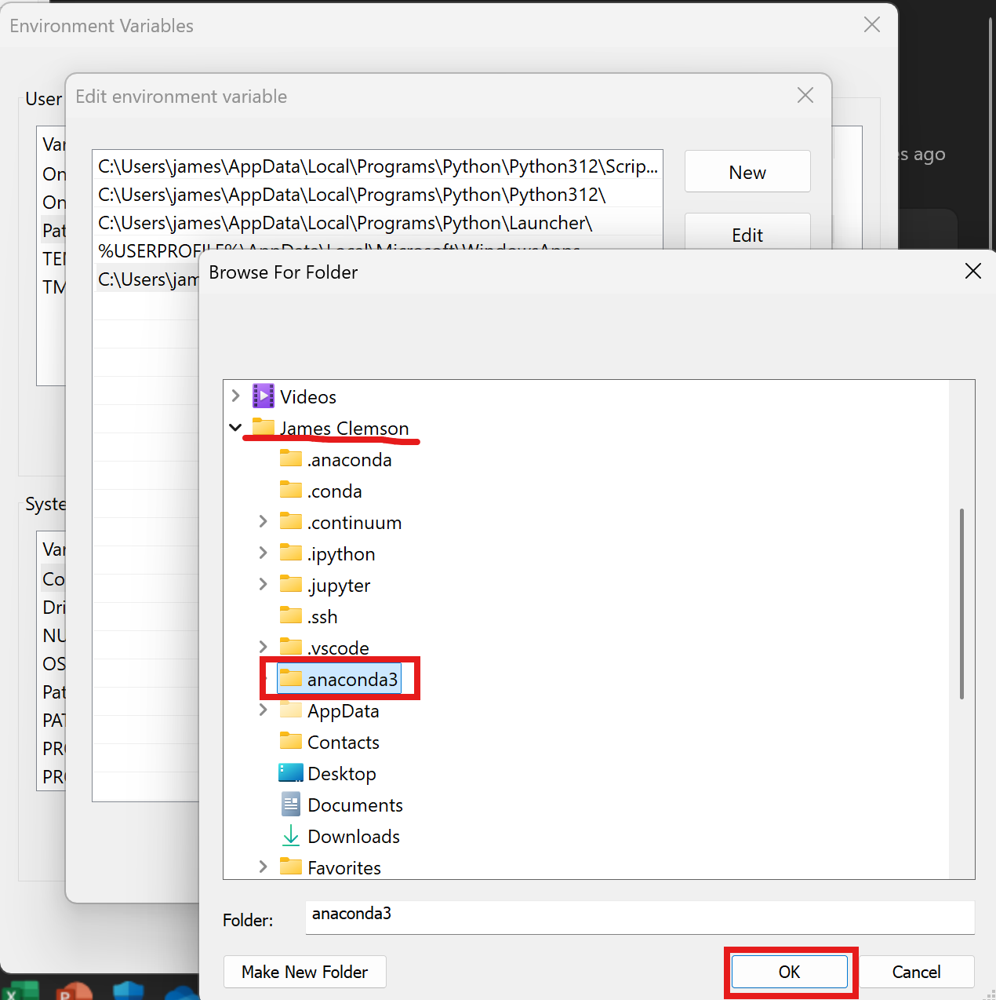

6. You should now see a new entry in the path environment variable editor with the file path you just selected (highlighted in green in the figure). Now, add a second path by clicking "New" and then "Browse" again.
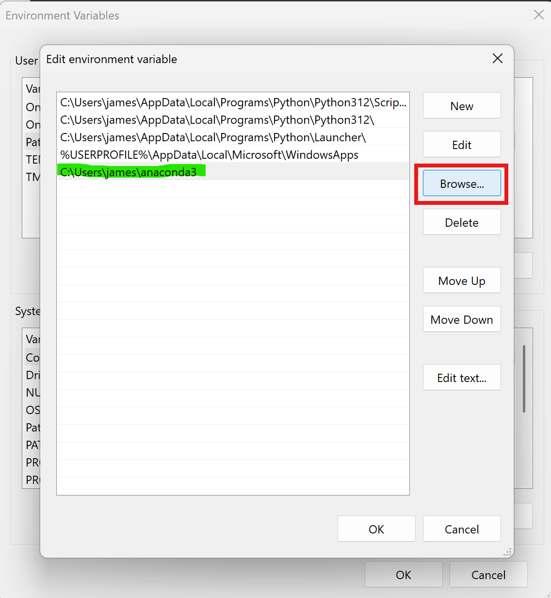

7. Now navigate to and select the "Scripts" subdirectory of the "anaconda3 folder" (The path should be `C:/Users/_username_/anaconda3/Scripts`). Then click "OK".
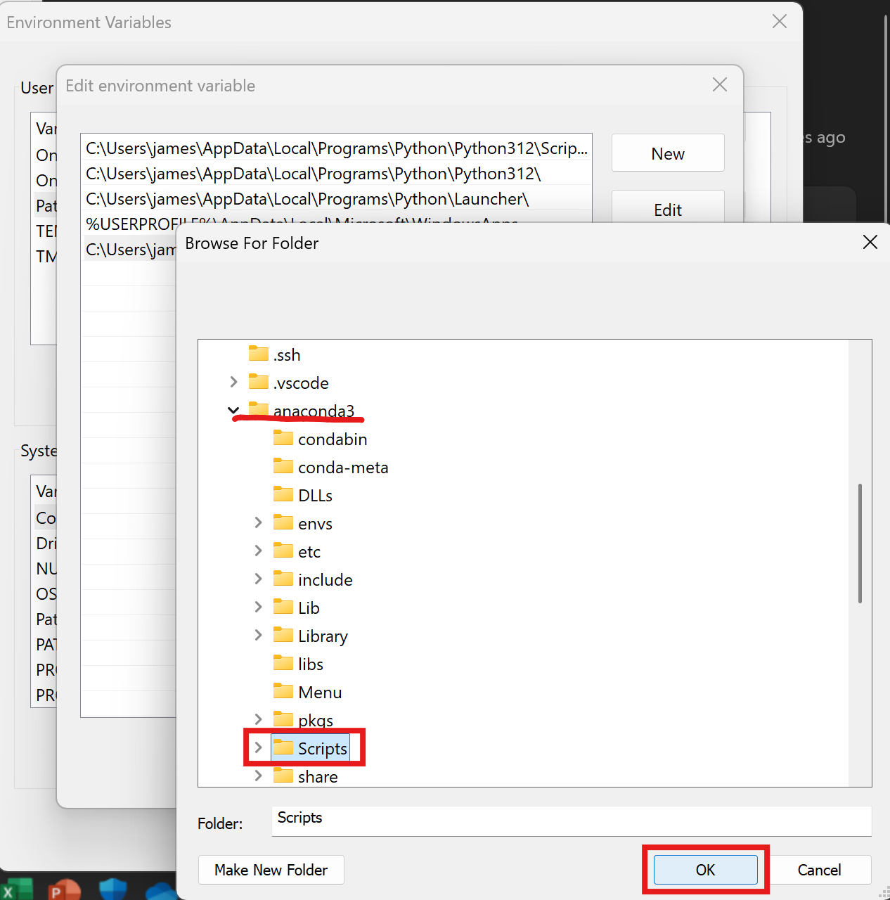

8. You should now see a second new entry in the path environment variable editor (Highlighted in green). You can now click "Ok" on all pop up windows to exit the advanced system settings.
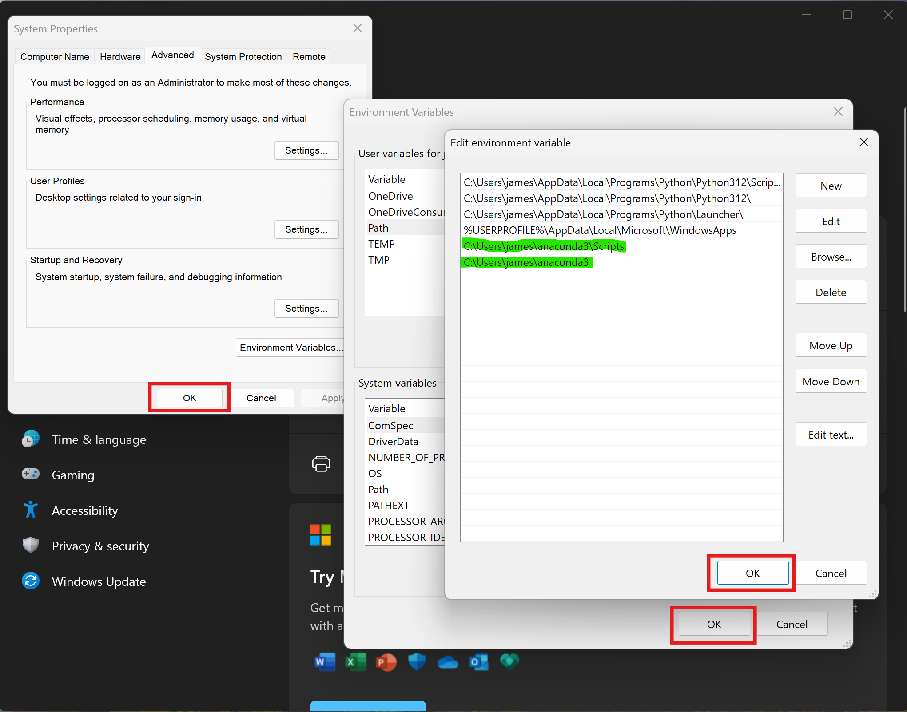

Conda should now be accessible and usable through the Bash terminal. To verify this, open up a new bash shell and type `conda --version`. It should report the current conda version, as shown in the image below.
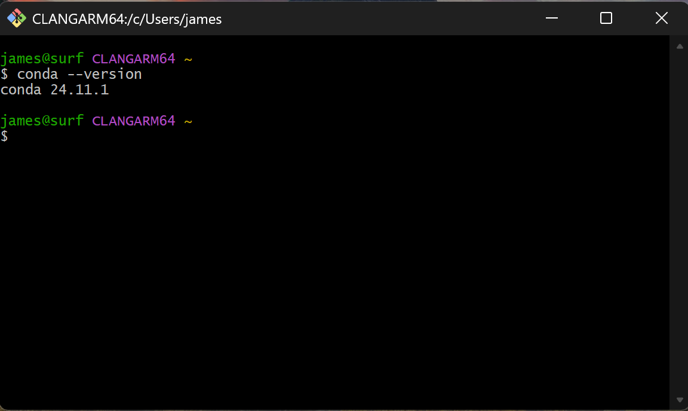

## Using Conda on Bash for Windows
Whenever opening a new terminal, check to see if conda is running (check if the name of the current environment is shown in parentheses above the prompt, as shown in the image below). If this line doesn't show up, run `source activate base` before any conda commands. This will load conda for the current shell.
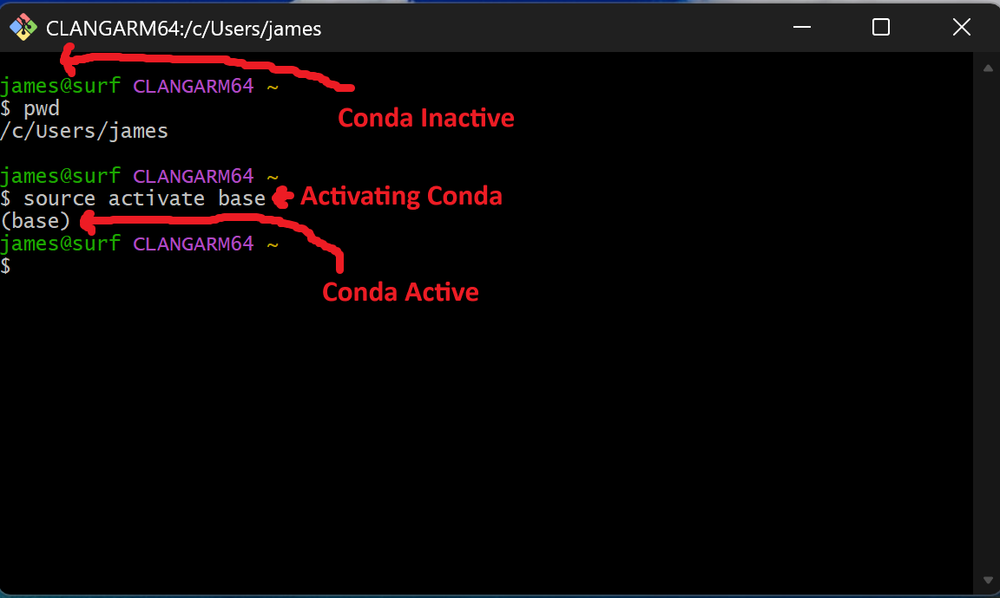

When creating new conda environments using `conda create`, install python (or whatever language you plan to use) when initializing it (Ex: `conda create -n <environment_name> python`). If you have a truly empty environment, it will automatically load the system python installation, which can lead to unexpected behavior.