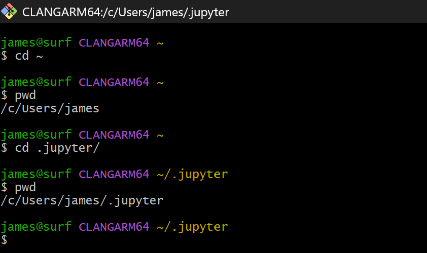
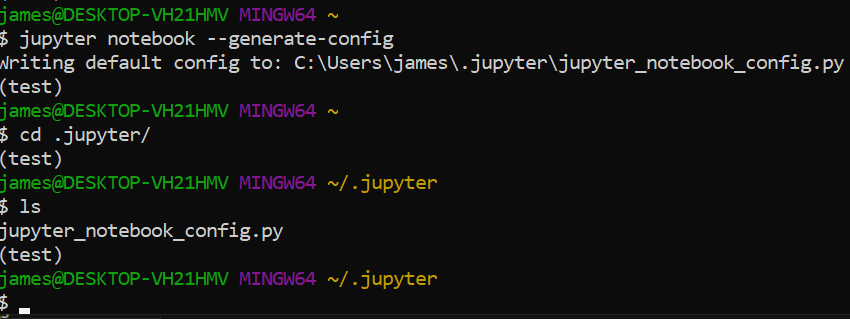
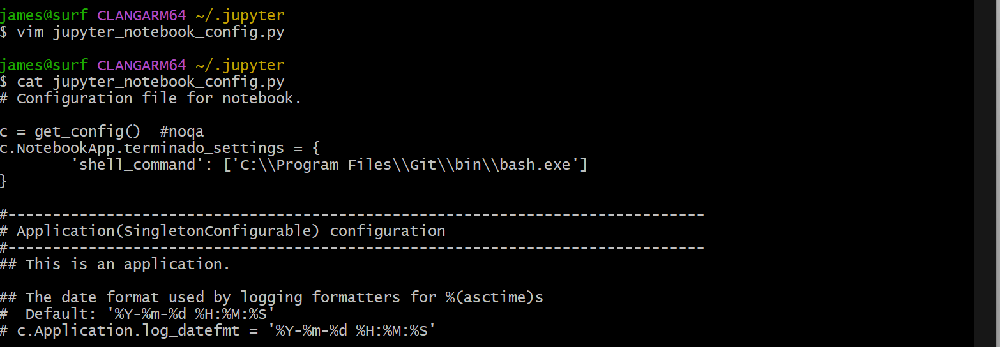

# Guide to Making Git Bash the Default Terminal in Jupyter Lab
Jupyter Labs will be used frequently throughout the semester, however its default terminal is Windows Powershell, whereas in this class we use Git Bash. This guide will walk you through configuring Jupyter so that you can use the bash shell by default from a Jupyter kernel.

## 1. Check if you have a `jupyter_notebook_config.py` File
You must first check if a config file for jupyter notebook exists. If you have used Jupyter in the past, this file likely already exists, but if you are working on a fresh intallation of Jupyter, you will most likely need to create one.

__a)__ First, navigate to the `.jupyter` file in your home user directory, as shown below. If this directory doesn't exist, proceed to step 2. If this is successful, go to step __b__.


__b)__ Run `ls` in the `.jupyter` directory. If the output contains the file `jupyter_notebook_config.py`, proceed to step 3. If not, proceed to step 2.

## 2. Create a `jupyter_notebook_config.py` File
- __NOTE:__ This step is only necessary if you do not already have this file, as determined in step 1. If the file already exists, skip this step and go to step 3.

__a)__ Run the code `jupyter notebook --generate-config`. Afterwards, navigate to the newly created file and verify `jupyter_notebook_config.py, as shown below.


## 3. Modify `jupyter_notebook_config.py` to make Bash the Default Terminal
__a)__ Open `jupyter_notebook_config.py` using the text editor of your choice. If unsure what to use, run the command `vim jupyter_notebook_config.py`.

__b)__ Insert the following lines into the config file. Once complete, save and exit the file.
```bash
c.NotebookApp.terminado_settings = {
    'shell_command': ['C:\\Program Files\\Git\\bin\\bash.exe']
    }
```
The exact location within the file does not strictly matter. If unsure, insert it in the line below `c = get_config()   #noqa`. For an example, see the image below (`cat` command was used to print out the file for visualization purposes).


## Conclusion
Jupyter should now be configured so that git bash is the default terminal. To finish the process, exit out of all bash shells and active Jupyter applications. When Jupyter is next booted, git bash should be the default terminal in any newly created shells