# Guide to Installing and Configuring VS Code in Windows
VS Code is a popular IDE which provides tools for software development. Its capabilities to integrate bash, conda, and Jupyter with traditional python make it a powerful tool. This guide will instruct you on downloading VS Code and configuring it to be able to support bash, conda, and Jupyter. If you already have VS Code installed, skip to the "VS Code Configuration Instructions" section, and add any components missing from your previous VS Code build.

## VS Code Installation Instructions

1. Navigate to [https://code.visualstudio.com/download](https://code.visualstudio.com/download) and click the download option for Windows.
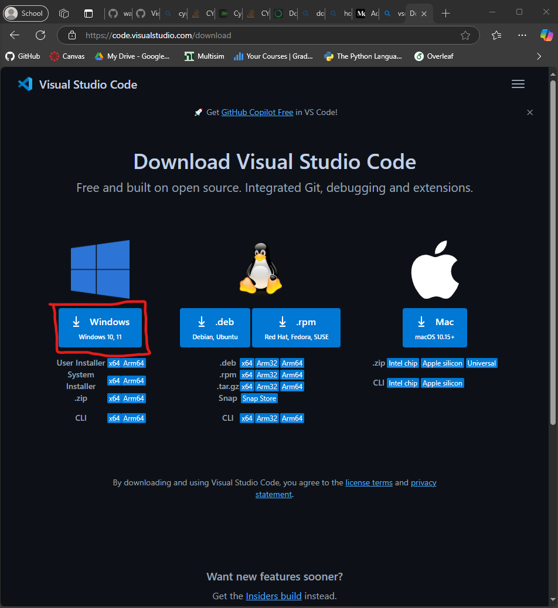

2. Once downloaded, open the installer. Click "I accept the agreement" and then click next
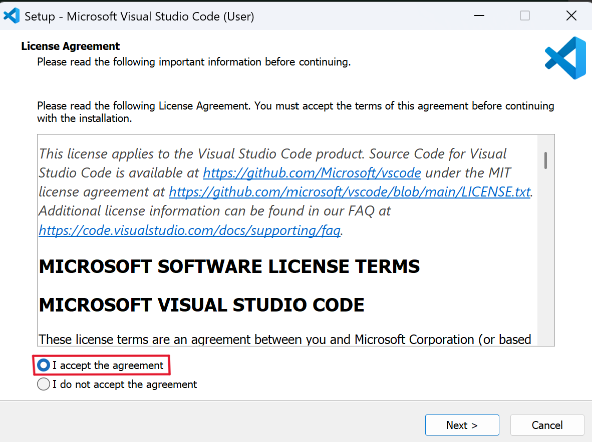

3. Leave the default destination folder as is and click next
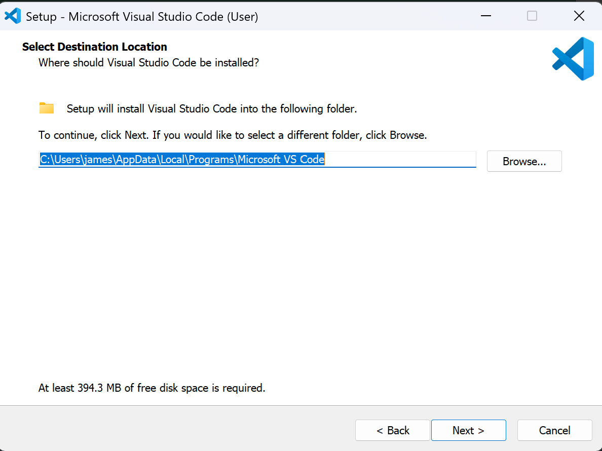

4. VS Code creates a shortcut in the Start Menu by default. If you would prefer, change or disable this option, then click next
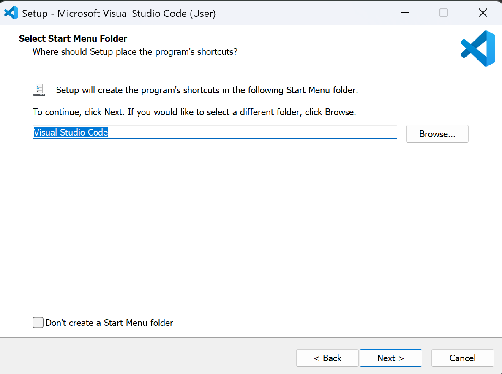

5. Configure the additional options as shown to register VS Code as an editor and add it to the PATH variable. Other options may be changed from the example configuration based on personal preference.
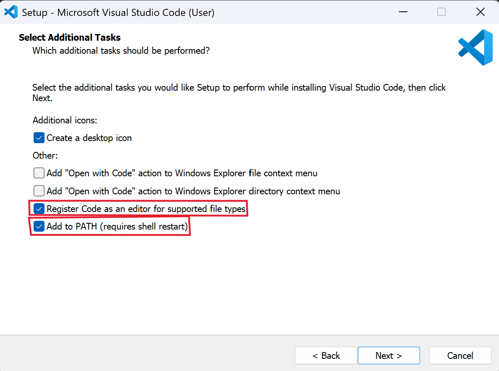

6. Verify Installation settings, then click "Install"
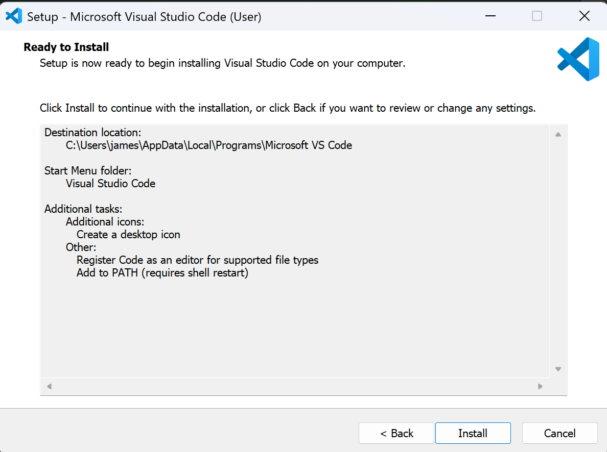

7. After the installation is complete, click "Finish" to exit the graphical installer. VS Code is now installed on your machine.
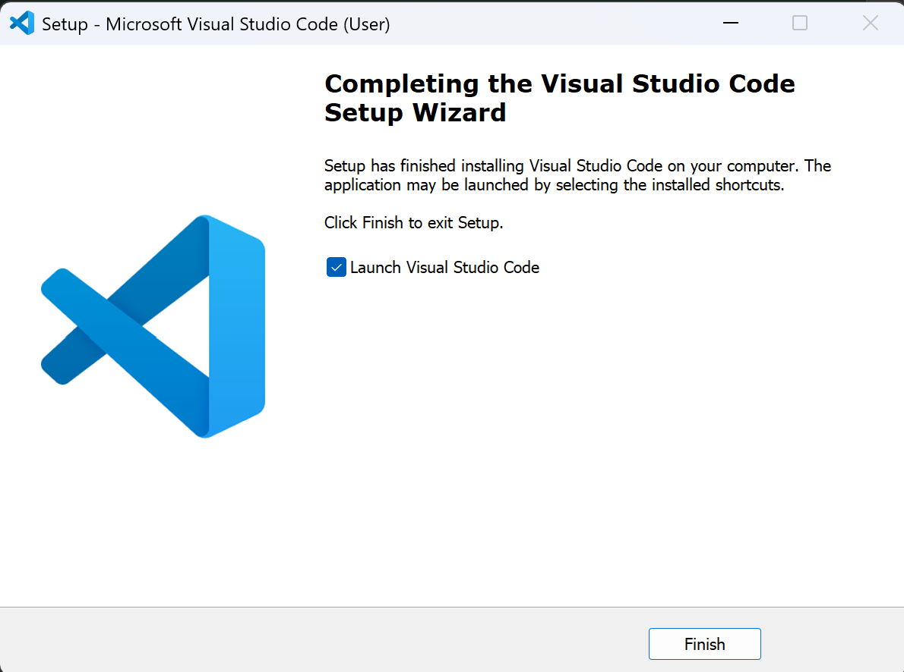

## VS Code Configuration Instructions
VS Code does not by default use the Bash editor, nor does it independently work with Jupyter or even Python. This section of the guide will show you how to set up VS Code to work with the tools used in this class.

1. Open VS Code. Click on the "Extensions" Tab to bring up the search bar, as shown below. From this menu, we need to install "Python" and "Jupyter" by clicking on the "Install" button next to those items (These packages should show up as "popular" when the extension tab opens, but if not, use the search bar in the Extensions Tab)
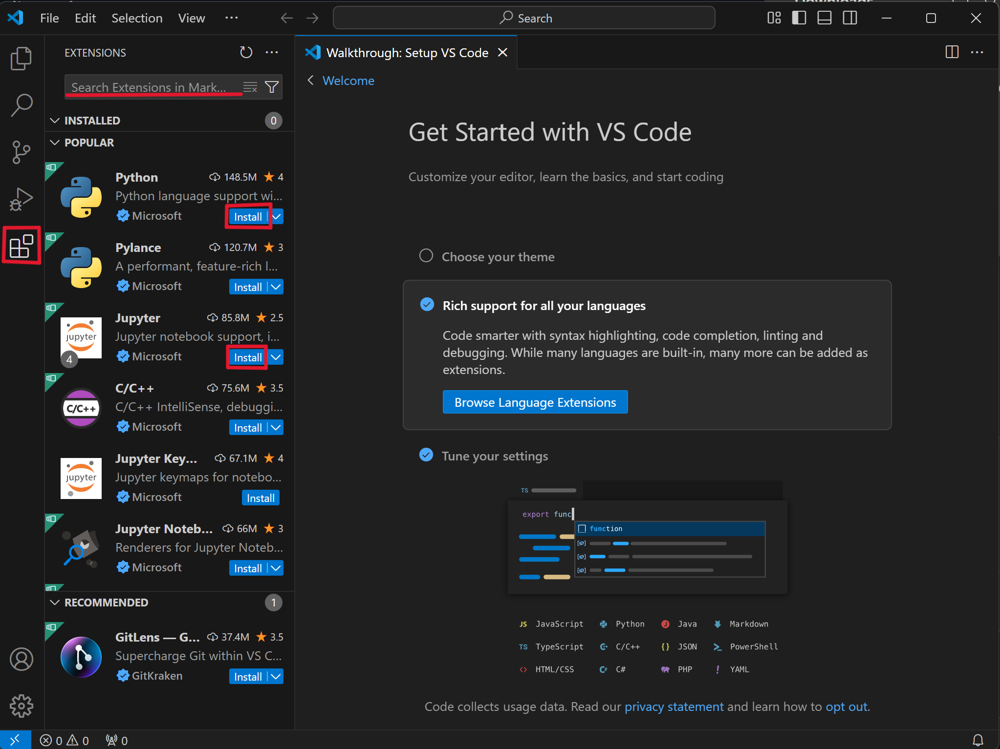

2. After these installations are complete, check to see if the extensions in the "Installed" tab of the "Extensions" tab match those shown in the example image (Required Package names highlighted in green). There should be 8 in total.
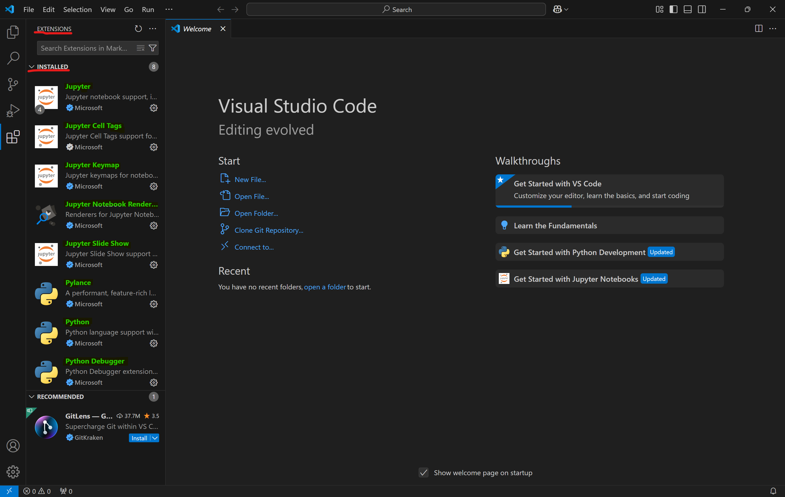

3. Now, use the command `Ctrl + Shift + P` to enter the command palette (or click on the search bar at the top of the VS code window and type ">").
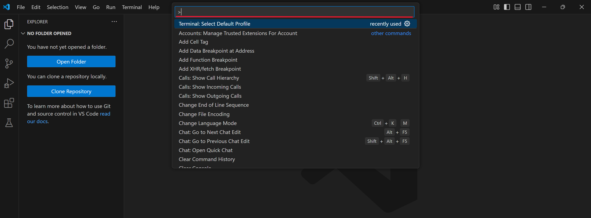

4. Type `Terminal: Select Default Profile`, and click on the suggested command (or hit enter after typing the entire command).
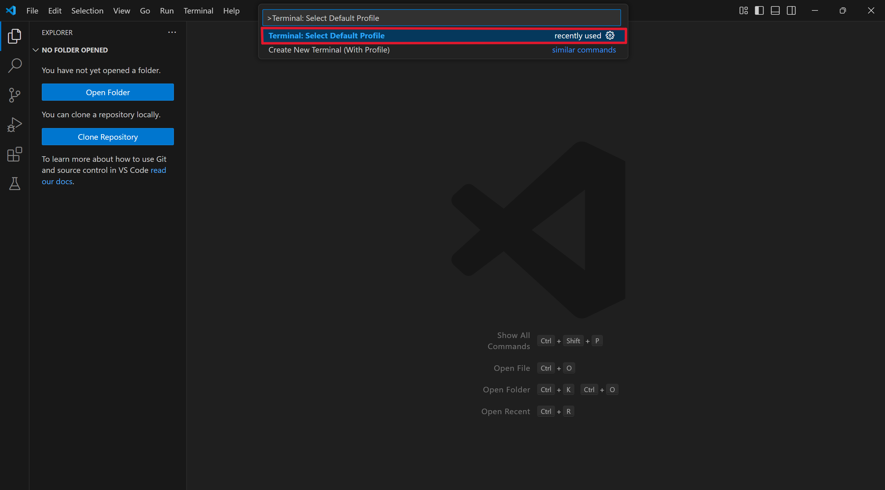

5. Click on the "Git Bash" option as shown.
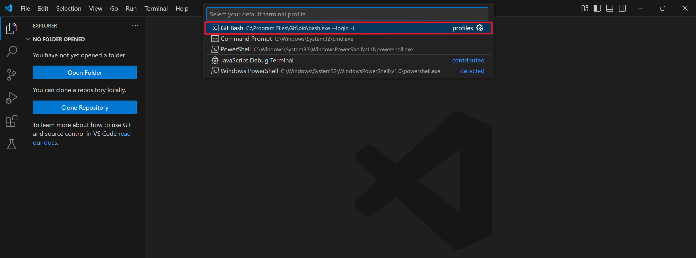

After closing and reopening VS Code, any new terminals created should default to Git Bash. Additionally, the installed extensions will allow you to create and open Jupyter notebooks in VS Code simply by typing code `_filename_.ipynb` into the integrated Bash terminal. If Conda has been added to the Windows Path variable (see the [Anaconda Installation and Setup Guide](anaconda_install_guide.md) for instructions on how to do this) then conda commands may be run from the integrated Bash Terminal (__NOTE:__ To use conda commands in the integrated terminal you must first run the command `source activate base` to enter the base conda environment.)